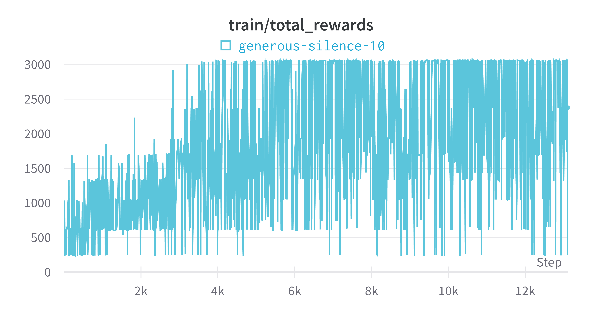

# DDQN to Beat Mario

## Link

WandB: https://wandb.ai/arth-shukla/Mario-DDQN

## Resources Used

I based the DDQN on the resource here: https://storage.googleapis.com/deepmind-media/dqn/DQNNaturePaper.pdf

## Technologies Used

Algorithms/Concepts: Double Deep Q Networks (DDQNs) building on Deep Q Networks (DQNs)

AI Development: Pytorch (Torch, Cuda)

## Evaluation and Inference

The DDQN was able to learn to play one level with fairly regular success:

<figure>
  <figcaption><h3>Total Reward by Episode</h3></figcaption>
  
</figure>

<figure>
  <figcaption><h3>DDQN After 13000 Episodes</h3></figcaption>
  
</figure>

Note that the DDQN does still sometimes fail, but in general it performs well.

The DDQN performs well because it uses a target network and altered loss function to avoid Q-value overestimation that plagues standard DQNs. However, it still has similar issues to DQNs of slow convergence, needing to learn experience data points multiple times to properly learn, etc.

## Future Experiments

I will run this with a PPO algo I wrote earlier for Cartpole (https://github.com/arth-shukla/ppo-gym-cartpole) altered to include the same convolutions. PPO should not only be able to run cartpole well, but it should be able to learn multiple levels or The Lost Levels (a version of Mario 2 not released in the west due to its difficulty), all of which is included in the Mario Gym API.

## About Me

Arth Shukla [Site](https://arth.website) | [GitHub](https://github.com/arth-shukla) | [LinkedIn](https://www.linkedin.com/in/arth-shukla/)
